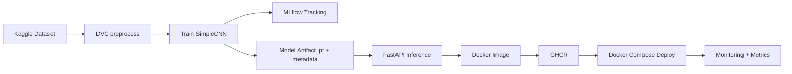
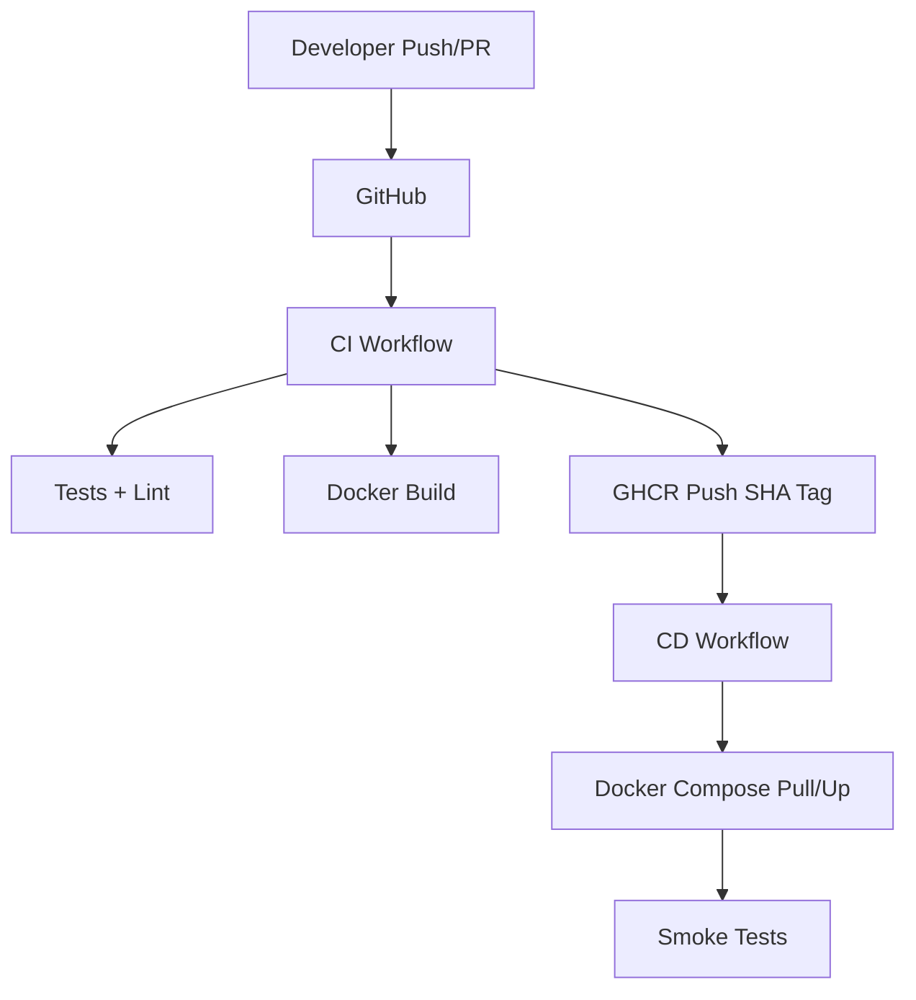

# Architecture

Layers:
- **domain**: core entities/types/ports.
- **application**: preprocessing, training, evaluation, inference use-cases.
- **infrastructure**: PyTorch checkpoint IO, MLflow tracking, observability.
- **interfaces**: FastAPI HTTP API and scripts/CLI entrypoints.

